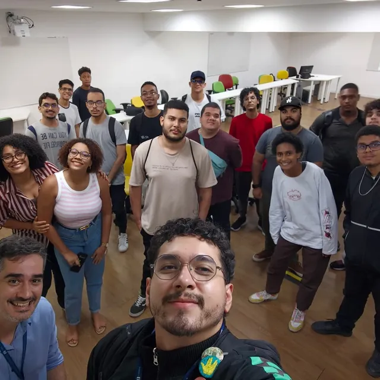
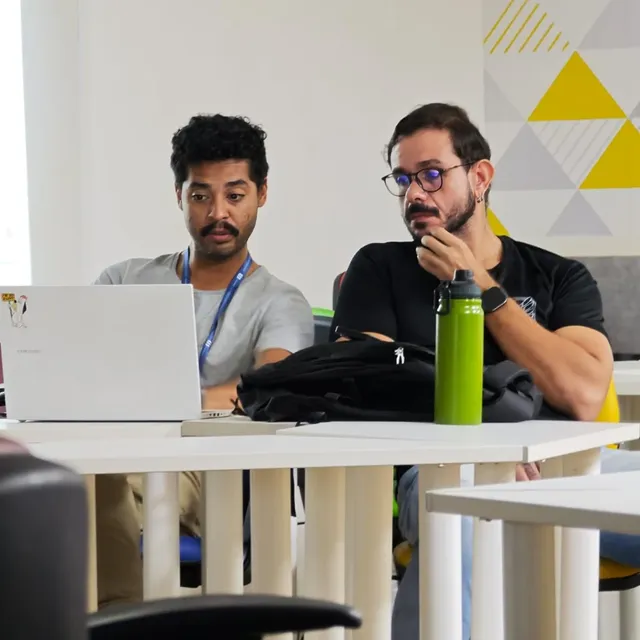
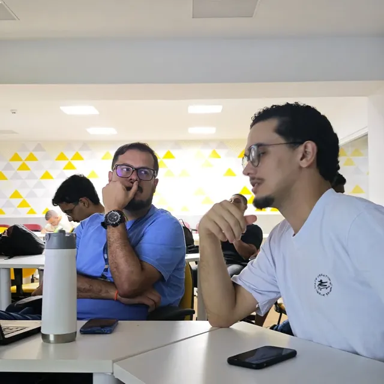
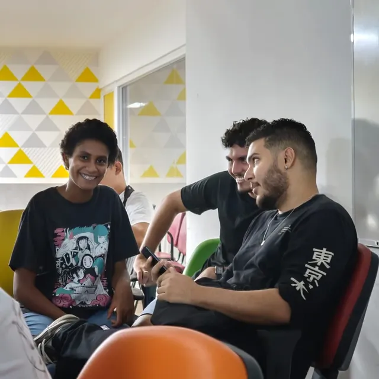
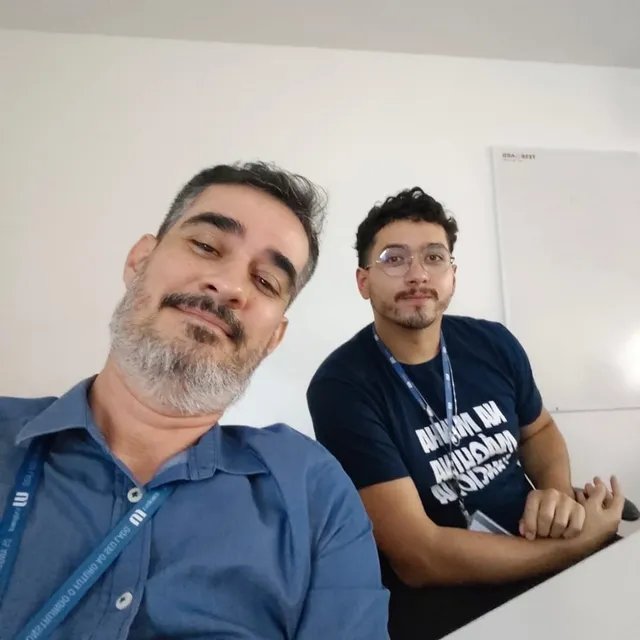
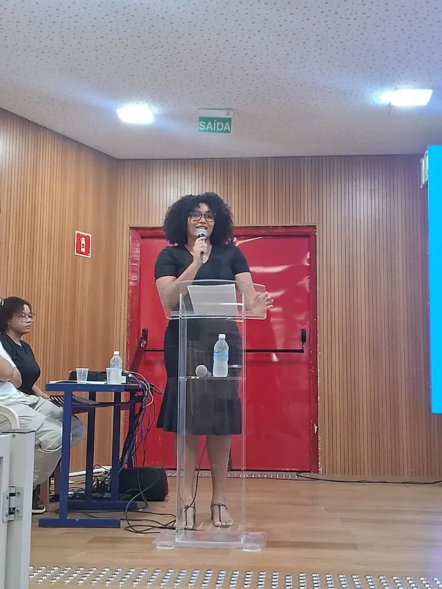
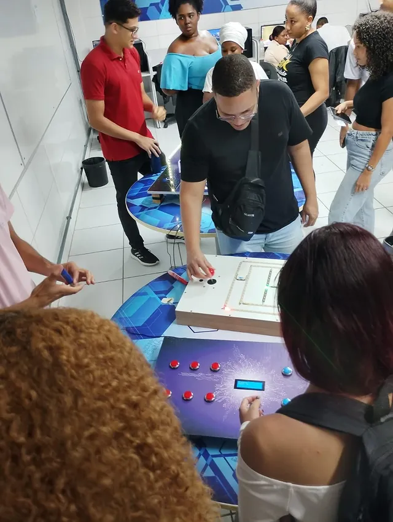

# NITE - Site de Recrutamento

Um site feito para transformar o processo de recrutamento do **NITE, Núcleo de Inovação e Tecnologia da UJ**, em uma experiência mais bonita, própria e acolhedora.

A ideia nasceu de uma necessidade simples: ajudar meu coordenador e o núcleo a saírem do fluxo frio de um Google Forms e terem uma página com identidade, narrativa e cuidado visual. Mais do que coletar respostas, o site tenta mostrar para quem chega que o NITE é um lugar vivo: tem gente aprendendo, testando ideias, construindo projetos e criando tecnologia dentro da universidade.

## Por que este projeto existe

O recrutamento é o primeiro contato de muita gente com o NITE. Se esse contato parece genérico, a pessoa também sente que o processo é genérico.

Este site foi pensado para fazer o contrário:

- apresentar o NITE com uma estética tecnológica e cinematográfica;
- explicar as trilhas de entrada de um jeito claro;
- mostrar o processo seletivo como uma jornada, não como um formulário solto;
- valorizar as pessoas, encontros e bastidores do núcleo;
- dar ao coordenador uma base melhor para divulgar, receber inscrições e evoluir o processo.

No fundo, é um projeto sobre cuidado. Cuidado com a primeira impressão, com quem vai se candidatar e com o trabalho de quem coordena o núcleo.

## O que é o NITE

O NITE é um núcleo de inovação e tecnologia conectado à vida acadêmica da UJ. Ele reúne estudantes, mentores e colaboradores interessados em desenvolvimento, dados, inteligência artificial, pesquisa aplicada, produto, design, infraestrutura e experimentação.

É um espaço para aprender construindo. Um lugar para transformar curiosidade em projeto, repertório em prática e vontade em portfólio.

<div align="center">
  
  
  
</div>

## Experiência criada

O site foi desenhado para parecer menos institucional e mais imersivo. Ele usa animações, parallax e transições para criar ritmo durante a navegação, sem abandonar a clareza.

Algumas partes importantes:

- **Hero cinematográfico** com identidade visual inspirada na logo do NITE.
- **Loading global** com clima de inicialização tecnológica.
- **Seção de trilhas** com circuito neon que se desenha durante o scroll.
- **Processo seletivo** com estética de laboratório e fluxo animado.
- **Página de inscrição** separada, com 10 perguntas paginadas.
- **Galeria final** com fotos reais do núcleo e link para o Instagram.

<div align="center">
  
  
  
  
</div>

## Tecnologias

- [Next.js](https://nextjs.org/)
- TypeScript
- Tailwind CSS
- GSAP + ScrollTrigger
- Server Actions
- Componentes client/server organizados
- `next/image` para otimização das imagens locais

## Rodando localmente

Instale as dependências:

```bash
npm install
```

Inicie o ambiente de desenvolvimento:

```bash
npm run dev
```

Abra no navegador:

```txt
http://localhost:3000
```

## Scripts úteis

```bash
npm run lint
npm run build
```

## Estrutura principal

```txt
src/app
  page.tsx              Página inicial
  inscricao/page.tsx    Página de inscrição paginada
  actions.ts            Server Action do formulário
  icon.tsx              Ícone da aba

src/components
  hero-section.tsx
  tracks-section.tsx
  tracks-circuit.tsx
  process-section.tsx
  process-lab.tsx
  instagram-gallery-section.tsx
  paginated-application-form.tsx
  global-loader.tsx

src/lib
  recruitment-data.ts   Textos, trilhas, perguntas e galeria
```

## Próximos passos possíveis

- Conectar o formulário a um banco de dados.
- Enviar inscrições por e-mail para a coordenação.
- Criar painel administrativo para acompanhar candidatos.
- Integrar com Instagram Graph API para atualizar a galeria automaticamente.
- Adicionar autenticação para coordenadores.

## Sobre

Este projeto foi criado como uma forma de contribuir com o NITE e facilitar o trabalho da coordenação, oferecendo uma experiência de recrutamento mais profissional, humana e memorável.

Feito com carinho para o Núcleo de Inovação e Tecnologia da UJ.
